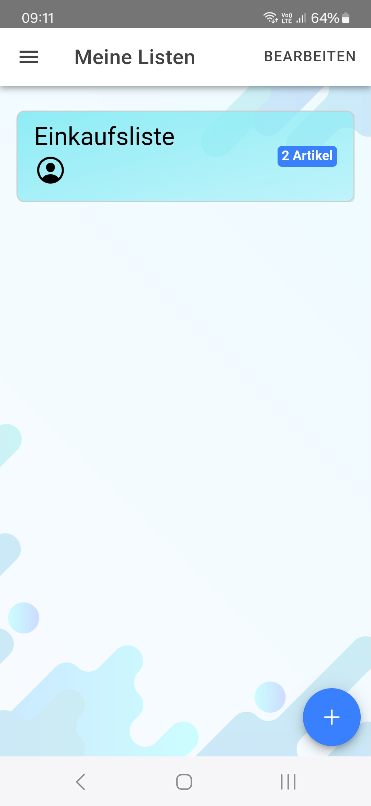

# MyLists

An Ionic app to manage lists among multiple users.

You can create an account to manage your lists and favorite stores. Share your list with other people by scanning the other person's QR code with the integrated QR code scanner. You can add articles to your list and choose from a variety of already defined products, thanks to the autocomplete function. Thanks to the cloud database, your lists & items remain up-to-date for everyone and can be accessed from any device.

**Techstack:**
+ Ionic & Capacitor (QR-Code scanner)
+ Angular (AngularFire)
+ Firebase (E-Mail Authentication & Firestore NoSQL-Cloud-Database)

  
  